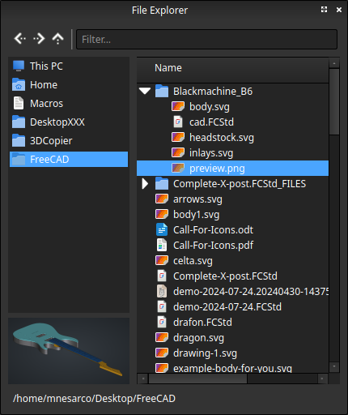

# File Explorer Addon for FreeCAD

This is a small Addon to bring an internal file explorer to FreeCAD with integrated actions.

# Features

- Favorites
- Open in FreeCAD
- Open in external Application
- Import in current document
- Duplicate files
- Filter
- Browse in system file explorer
- Preview panel (Images and FreeCAD files)
- Dockable
- Drag & Drop
- Context menu actions

# Prerequisite

- Qt6 (Officially supported)
- Qt5 (May work, but officially unsupported)

# Forum

https://forum.freecad.org/viewtopic.php?t=102035

